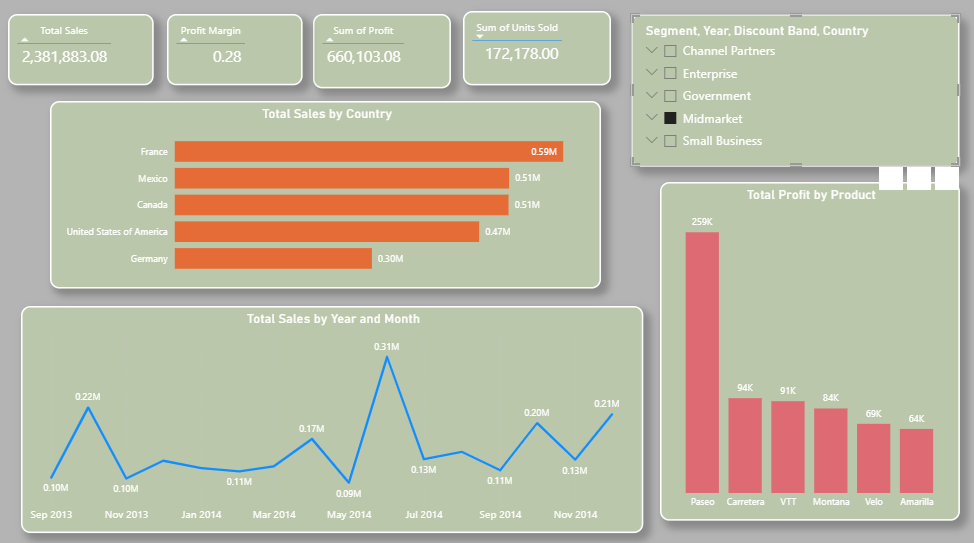
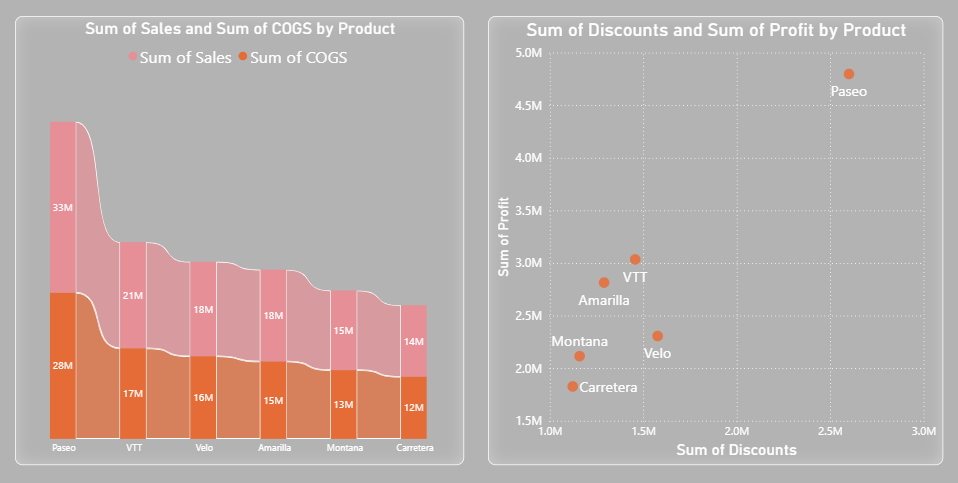

# Financial Sample Dashboard (Power BI)
## About the Project

The **Financial Sample Dashboard** is an interactive Power BI project designed to analyze sales, profit, discounts, and product performance across different countries and customer segments.

This dashboard provides meaningful insights to help businesses understand financial trends, identify top-performing products, and make data-driven decisions.

## Key Features

* **Sales Analysis** by country and time (year & month)
* **Profit Insights** across products
* **Product Performance Comparison**
* **Discount vs Profit Relationship**
* **Country-wise Sales Distribution**
* Interactive filters (Segment, Year, Discount Band, Country)

## Tools & Technologies Used

* **Power BI**
* **Microsoft Excel (Dataset)**
* Data Visualization
* Data Cleaning & Transformation

## Dashboard Screenshots

### Executive Overview



### Profit Analysis



##  Project Structure

```
financial_sample/
│── financialsample.pbix        # Power BI Dashboard File
│── financial data.xlsx         # Dataset
│── executive overview.png      # Dashboard Screenshot 1
│── profit analysis.png         # Dashboard Screenshot 2
│── README.md                  # Project Documentation
```

## How to Use

1. Download the `.pbix` file
2. Open it in **Power BI Desktop**
3. Explore interactive visuals and filters

## Insights Derived

* France has the highest total sales among all countries
* Paseo product generates the highest profit
* Discounts have a direct impact on profit margins
* Seasonal trends are visible in monthly sales data


## Author

**Manpreet Kaur**

*  GitHub: https://github.com/ManpreetKaur96/financial_sample

## Project Highlights

This project demonstrates:
* Strong data visualization skills
* Business insight generation
* Dashboard design best practices


